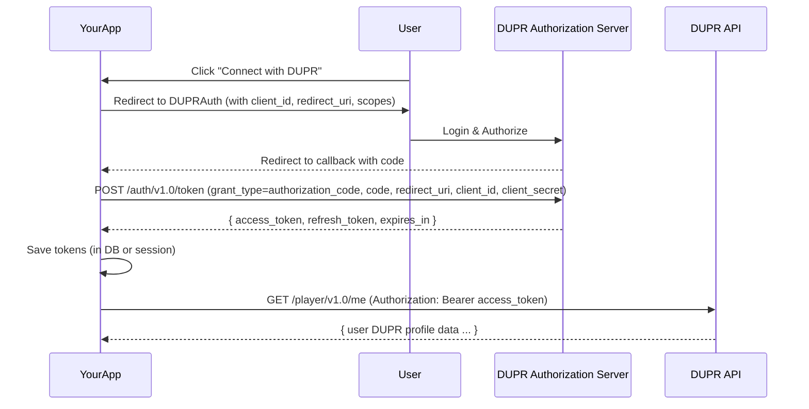

# dupr-js-client

[](https://github.com/sunnytambi/dupr-js-client/actions/workflows/ci.yml)
[](https://www.npmjs.com/package/dupr-js-client)
[](LICENSE)


A TypeScript/JavaScript client for the [DUPR (Dynamic Universal Pickleball Rating)](https://mydupr.com) Partner API.  
Modelled with inspiration from the Python library [dupr-api-client](https://libraries.io/pypi/dupr-api-client).

**Source:** OpenAPI 3.1.0 spec at `https://uat.mydupr.com/api/v3/api-docs/DUPR%20Partner%20APIs`

---

## Features

- Full coverage of the DUPR Partner API v1.0
- Auto-refreshing client-credentials token cache — transparent, no action required
- Authorization Code Flow support for user-facing "Connect DUPR" integrations
- Automatic retry with exponential backoff on 5xx and network errors; honours `Retry-After` on 429
- Typed request/response bodies for every endpoint
- Structured error hierarchy (`AuthenticationError`, `ValidationError`, `NotFoundError`, `RateLimitError`, `ServerError`)
- Dual ESM + CJS build — works in Node.js, Bun, and bundlers
- Zero runtime dependencies — uses the native `fetch` API (Node.js 18+)
- `customFetch` injection for testing, polyfilling, or proxying
- `onRequest` / `onResponse` hooks for logging and metrics

---

## Table of Contents

1. [Installation](#1-installation)
2. [Quick Start](#2-quick-start)
3. [Configuration](#3-configuration)
4. [Authentication](#4-authentication)
   - [Client Credentials](#41-client-credentials-server-to-server)
   - [Static Bearer Token](#42-static-bearer-token)
   - [Authorization Code Flow](#43-authorization-code-flow-connect-dupr-button)
5. [Retry Behaviour](#5-retry-behaviour)
6. [Error Handling](#6-error-handling)
7. [Observability Hooks](#7-observability-hooks)
8. [API Reference](#8-api-reference)
   - [client.auth](#81-clientauth)
   - [client.users](#82-clientusers)
   - [client.players](#83-clientplayers)
   - [client.playerRating](#84-clientplayerrating)
   - [client.matches](#85-clientmatches)
   - [client.clubs](#86-clientclubs)
   - [client.events](#87-clientevents)
   - [client.webhooks](#88-clientwebhooks)
9. [Type Reference](#9-type-reference)
10. [Testing](#10-testing)
11. [Express Integration Example](#11-express-integration-example)
12. [Regenerating Types from the OpenAPI Spec](#12-regenerating-types-from-the-openapi-spec)
13. [Development](#13-development)
14. [Contributing](#14-contributing)
15. [License](#15-license)

---

## 1. Installation

```bash
npm install dupr-js-client
```

**Requirements:** Node.js 18+ (native `fetch` and `AbortSignal.timeout`), TypeScript 5.x (optional — types are bundled).

The package ships both ESM (`dist/index.js`) and CJS (`dist/index.cjs`) with full `.d.ts` declarations.

---

## 2. Quick Start

```ts
import { DuprClient } from "dupr-js-client";

const client = new DuprClient({
  auth: {
    type: "clientCredentials",
    clientKey: process.env.DUPR_CLIENT_KEY!,
    clientSecret: process.env.DUPR_CLIENT_SECRET!,
  },
  // baseUrl defaults to "https://uat.mydupr.com/api"
  // version  defaults to "v1.0"
});

// Look up a player profile
const { result } = await client.users.getUser("ABC123");
console.log(result?.fullName, result?.doublesRating);

// Search players by name with filters
const found = await client.users.search({
  query: "Jane Smith",
  offset: 0,
  limit: 10,
  filters: { rating: { type: "DOUBLES", min: 4.0, max: 5.5 } },
});

// Submit a doubles match result
const match = await client.matches.create({
  identifier: "my-app-match-001",   // your universally unique ID — never reuse
  matchDate: "2024-06-15",          // yyyy-MM-dd
  matchFormat: "DOUBLES",
  source: "PARTNER",
  teams: [
    { players: [{ duprId: "AAA111" }, { duprId: "BBB222" }], scores: [11, 8] },
    { players: [{ duprId: "CCC333" }, { duprId: "DDD444" }], scores: [8, 11] },
  ],
});
console.log("Match code:", match.result?.matchCode);
```

---

## 3. Configuration

```ts
const client = new DuprClient(options);
```

### `DuprClientOptions`

| Option | Type | Default | Description |
|---|---|---|---|
| `auth` | `AuthMode` | `{ type: "none" }` | Authentication mode. See [§4](#4-authentication). |
| `baseUrl` | `string` | `"https://uat.mydupr.com/api"` | API base URL. Use `"https://mydupr.com/api"` for production. |
| `version` | `string` | `"v1.0"` | API version prefix inserted in all paths. |
| `timeoutMs` | `number` | `30_000` | Per-request timeout in milliseconds. |
| `userAgent` | `string` | `"dupr-js-client/0.1.0"` | `User-Agent` header sent on every request. |
| `customFetch` | `typeof fetch` | `globalThis.fetch` | Inject a custom fetch — useful for mocking in tests or polyfilling. |
| `retry` | `RetryOptions \| false` | see below | Retry policy for transient errors. Pass `false` to disable. |
| `onRequest` | `(info: RequestInfo) => void` | — | Called before every request. Useful for logging. |
| `onResponse` | `(info: ResponseInfo) => void` | — | Called after every response. Useful for metrics. |

### `RetryOptions`

| Option | Type | Default | Description |
|---|---|---|---|
| `maxRetries` | `number` | `3` | Maximum retry attempts after the initial failure. |
| `baseDelayMs` | `number` | `1_000` | Base backoff delay in ms. Doubles each attempt with ±20% jitter. |
| `maxDelayMs` | `number` | `30_000` | Maximum backoff cap in ms. |

### Environment variables pattern

```ts
// duprClient.ts
import { DuprClient } from "dupr-js-client";

export const dupr = new DuprClient({
  baseUrl: process.env.DUPR_API_BASE_URL ?? "https://uat.mydupr.com/api",
  auth: {
    type: "clientCredentials",
    clientKey: process.env.DUPR_CLIENT_KEY!,
    clientSecret: process.env.DUPR_CLIENT_SECRET!,
  },
});
```

```ini
# .env
DUPR_API_BASE_URL=https://uat.mydupr.com/api
DUPR_CLIENT_KEY=your_client_key
DUPR_CLIENT_SECRET=your_client_secret
```

---

## 4. Authentication

### 4.1 Client Credentials (server-to-server)

The standard mode for backend services. The SDK acquires and silently refreshes tokens.

**Internally:** POSTs to `POST /auth/{version}/token` with an `x-authorization: base64(clientKey:clientSecret)` header. The response token is cached until 60 seconds before expiry, then auto-refreshed. No action required from your code.

```ts
const client = new DuprClient({
  auth: {
    type: "clientCredentials",
    clientKey: "your_client_key",
    clientSecret: "your_client_secret",
  },
});

// Optionally pre-warm the token cache on startup:
const { token, expiresIn } = await client.auth.getToken();
```

---

### 4.2 Static Bearer Token

Use when your backend handles authentication and injects a pre-obtained JWT. No token refresh is attempted.

```ts
// Fixed token
const client = new DuprClient({
  auth: { type: "staticBearer", bearerToken: "eyJ..." },
});

// Runtime injection — swap the token without rebuilding the client
client.setBearerToken("new-eyJ...");
client.clearBearerToken();   // revert to configured auth mode
```

---

### 4.3 Authorization Code Flow ("Connect DUPR" button)

Use this flow to let your **end-users** authorise your app to act on their behalf — for example, showing a player's personal DUPR rating inside your app.

> **Note:** This requires a DUPR OAuth application with a user-facing authorization endpoint, separate from the Partner API client credentials. Contact DUPR support for the authorization URL and OAuth application credentials.

#### Flow overview

```
User clicks "Connect DUPR"
        │
        ▼
1. Build authorization URL  →  client.auth.getAuthorizationUrl({ redirectUri, state })
        │
        ▼
2. Redirect user to that URL (DUPR login page)
        │
        ▼
3. User approves  →  DUPR redirects to your redirectUri?code=AUTH_CODE&state=STATE
        │
        ▼
4. Exchange code  →  client.auth.exchangeCode({ code, redirectUri })
        │              returns { token, refresh_token, expiresIn }
        ▼
5. Store tokens. Call client.setBearerToken(token) for API calls.
        │
        ▼
6. On expiry  →  client.auth.refreshToken(refresh_token)
```



#### Implementation

**Step 1 — initiate the flow:**

```ts
import crypto from "node:crypto";

// Inject authorizationUrl (confirm the exact URL with DUPR support)
(client.config as any).authorizationUrl = "https://auth.mydupr.com/oauth/authorize";

app.get("/auth/dupr/connect", (req, res) => {
  const state = crypto.randomBytes(16).toString("hex");
  req.session.duprOAuthState = state;

  const url = client.auth.getAuthorizationUrl({
    redirectUri: "https://yourapp.com/auth/dupr/callback",
    scopes: ["user.read"],
    state,
  });

  res.redirect(url);
});
```

**Step 2 — handle the callback:**

```ts
app.get("/auth/dupr/callback", async (req, res) => {
  const { code, state } = req.query as Record<string, string>;

  if (state !== req.session.duprOAuthState) {
    return res.status(400).send("Invalid state");
  }

  const tokens = await client.auth.exchangeCode({
    code,
    redirectUri: "https://yourapp.com/auth/dupr/callback",
  });

  await db.users.update(req.user.id, {
    duprAccessToken: tokens.token,
    duprRefreshToken: tokens.refresh_token,
    duprTokenExpiresAt: Date.now() + (tokens.expiresIn ?? 3600) * 1000,
  });

  res.redirect("/profile");
});
```

**Step 3 — use the user token:**

```ts
client.setBearerToken(user.duprAccessToken);
const profile = await client.users.getUser(user.duprId);
```

**Step 4 — refresh on expiry:**

```ts
async function getValidToken(user: UserRecord): Promise<string> {
  if (Date.now() < user.duprTokenExpiresAt - 60_000) return user.duprAccessToken;

  const refreshed = await client.auth.refreshToken(user.duprRefreshToken);
  await db.users.update(user.id, {
    duprAccessToken: refreshed.token!,
    duprRefreshToken: refreshed.refresh_token ?? user.duprRefreshToken,
    duprTokenExpiresAt: Date.now() + (refreshed.expiresIn ?? 3600) * 1000,
  });
  return refreshed.token!;
}
```

---

## 5. Retry Behaviour

The SDK automatically retries requests that fail with transient errors.

| Condition | Retried? | Notes |
|---|---|---|
| `ServerError` (5xx) | Yes | |
| `RateLimitError` (429) | Yes | Honours `Retry-After` response header if present |
| Network failure (`TypeError`) | Yes | Connection refused, DNS failure, etc. |
| `ValidationError` (400) | **No** | Fix the request |
| `NotFoundError` (404) | **No** | Resource does not exist |
| `AuthenticationError` (401/403) | **No** | Fix credentials |

**Backoff formula:** `delay = min(baseDelayMs × 2ⁿ, maxDelayMs) × jitter(0.8–1.2)`

```ts
// Custom retry policy
const client = new DuprClient({
  auth: { ... },
  retry: { maxRetries: 5, baseDelayMs: 500, maxDelayMs: 60_000 },
});

// Disable retry (e.g. for write operations where idempotency is not guaranteed)
const client = new DuprClient({
  auth: { ... },
  retry: false,
});
```

---

## 6. Error Handling

All errors extend `DuprApiError`.

```
DuprApiError
├── AuthenticationError   (401, 403)
├── ValidationError       (400)
├── NotFoundError         (404)
├── RateLimitError        (429)
└── ServerError           (5xx)
```

### `DuprApiError` properties

| Property | Type | Description |
|---|---|---|
| `message` | `string` | Human-readable description from the DUPR response, or a generated fallback. |
| `statusCode` | `number` | HTTP status code. |
| `details` | `unknown` | Raw parsed response body. |
| `duprRequestId` | `string \| undefined` | Value of `x-request-id` response header — include in support tickets. |

```ts
import {
  DuprApiError,
  AuthenticationError,
  ValidationError,
  NotFoundError,
  RateLimitError,
  ServerError,
} from "dupr-js-client";

try {
  await client.matches.create(payload);
} catch (err) {
  if (err instanceof ValidationError) {
    console.error("Bad request:", err.details);
  } else if (err instanceof RateLimitError) {
    // SDK already retried — you've genuinely hit the cap
    console.warn("Rate limited.");
  } else if (err instanceof AuthenticationError) {
    console.error("Auth failed:", err.message);
  } else if (err instanceof NotFoundError) {
    console.warn("Resource not found.");
  } else if (err instanceof ServerError) {
    console.error("DUPR server error. Request ID:", err.duprRequestId);
  } else if (err instanceof DuprApiError) {
    console.error(`HTTP ${err.statusCode}:`, err.message);
  } else {
    throw err;
  }
}
```

---

## 7. Observability Hooks

`onRequest` and `onResponse` let you integrate with any logging or metrics system without wrapping individual calls.

```ts
import pino from "pino";

const log = pino();

const client = new DuprClient({
  auth: { ... },

  onRequest({ method, url }) {
    log.debug({ method, url }, "→ DUPR");
  },

  onResponse({ status, url, durationMs }) {
    log.debug({ status, url, durationMs }, "← DUPR");
    metrics.histogram("dupr.latency", durationMs, { status: String(status) });
    if (status >= 400) metrics.counter("dupr.errors", 1, { status: String(status) });
  },
});
```

`onResponse` fires once per attempt, including retried attempts. To record only final outcomes, track state in your own closure.

---

## 8. API Reference

All methods return `Promise<ApiWrapper<T>>`.

```ts
interface ApiWrapper<T = unknown> {
  status: "SUCCESS" | "FAILURE";
  message?: string;
  result?: T;       // the actual payload
}
```

---

### 8.1 `client.auth`

| Method | Description |
|---|---|
| `getToken()` | Explicitly fetch a client-credentials token. Normally auto-managed. |
| `getAuthorizationUrl(params)` | Build the OAuth redirect URL for user-facing login. |
| `exchangeCode({ code, redirectUri })` | Exchange an auth code for `{ token, refresh_token, expiresIn }`. |
| `refreshToken(refreshToken)` | Get a new access token using a refresh token. |

See [§4](#4-authentication) for full examples.

---

### 8.2 `client.users`

| Method | Endpoint | Description |
|---|---|---|
| `getUser(duprId)` | `GET /user/{v}/{id}` | Basic player profile |
| `getExtendedUser(duprId)` | `GET /user/{v}/{id}/details` | Profile + email (requires `USER_EMAIL::VIEW` permission) |
| `getClubMemberships(duprId)` | `GET /user/{v}/{id}/clubs` | Club memberships |
| `search(req)` | `POST /user/{v}/search` | Full-text search with optional filters |
| `getBatch(req)` | `POST /user/{v}/batch` | Fetch multiple players by DUPR ID in one request |
| `invite(req)` | `POST /user/{v}/invite` | Pre-generate a DUPR ID and send an invite email |
| `grantSubscription(req)` | `POST /user/{v}/subscription/grants` | Grant a product subscription to a user |
| `getProvisionalRating(req)` | `POST /user/{v}/provisional_rating` | Get provisional ratings |
| `createProvisionalRating(req)` | `POST /user/{v}/provisional_rating/create` | Set provisional ratings |
| `updateProvisionalRating(req)` | `POST /user/{v}/provisional_rating/update` | Update provisional ratings |
| `deleteProvisionalRating(req)` | `DELETE /user/{v}/provisional_rating/delete` | Delete provisional ratings |

**`search` example with filters:**

```ts
const results = await client.users.search({
  query: "Maria Garcia",
  offset: 0,
  limit: 20,
  filters: {
    gender: "FEMALE",
    rating: { type: "DOUBLES", min: 4.0, max: 5.5, reliable: true },
    location: { lat: 37.77, lng: -122.41, radiusInMeters: 50_000 },
    age: { min: 25, max: 45 },
  },
});
```

---

### 8.3 `client.players`

| Method | Endpoint | Description |
|---|---|---|
| `getDuprIdByEmail({ email })` | `POST /{v}/player/duprid-by-email` | Resolve a DUPR ID from an email address |

```ts
const { result } = await client.players.getDuprIdByEmail({ email: "player@example.com" });
// result: { duprId: "XYZ789" }
```

---

### 8.4 `client.playerRating`

| Method | Endpoint | Description |
|---|---|---|
| `getHistory(req)` | `POST /history` | Rating history for a player |
| `getSubscriptions()` | `GET /{v}/subscribe/rating-changes` | List currently subscribed DUPR IDs |
| `subscribe(req)` | `POST /{v}/subscribe/rating-changes` | Subscribe to rating-change events |
| `unsubscribe(req)` | `DELETE /{v}/subscribe/rating-changes` | Unsubscribe from rating-change events |

```ts
// Fetch rating history
const { result } = await client.playerRating.getHistory({
  duprId: "ABC123",
  offset: 0,
  limit: 50,
});
// result: [{ date, singlesRating, doublesRating }, ...]

// Subscribe to webhook notifications for a list of players
await client.playerRating.subscribe({ duprIds: ["AAA111", "BBB222"] });
```

---

### 8.5 `client.matches`

> **Important:** The `identifier` field must be universally unique across your entire application. It must never be reused, even if a match is deleted.

| Method | Endpoint | Description |
|---|---|---|
| `get(matchId)` | `GET /match/{v}/{id}` | View a match by DUPR match code |
| `create(match)` | `POST /match/{v}/create` | Submit a new match result |
| `createBulk(matches[])` | `POST /match/{v}/batch` | Submit multiple matches at once |
| `update(req)` | `POST /match/{v}/update` | Update an existing match |
| `delete(req)` | `DELETE /match/{v}/delete` | Delete a match |
| `annotate(req)` | `POST /match/{v}/annotate` | Attach vendor metadata to a match |
| `deleteAnnotation(matchId)` | `DELETE /match/{v}/annotate/{id}` | Remove a match annotation |
| `searchHistory(req)` | `POST /match/history/search` | Search a player's match history |

**`create` full example:**

```ts
const { result } = await client.matches.create({
  identifier: "session-42-match-7",   // your unique ID
  matchDate: "2024-06-15",
  matchFormat: "DOUBLES",
  source: "PARTNER",
  teams: [
    {
      players: [{ duprId: "AAA111" }, { duprId: "BBB222" }],
      scores: [11, 7, 11],   // scores per game (won games 1 and 3)
    },
    {
      players: [{ duprId: "CCC333" }, { duprId: "DDD444" }],
      scores: [8, 11, 9],
    },
  ],
  clubId: 123,    // optional
  eventId: 456,   // optional
});
console.log(result?.matchCode);   // DUPR's canonical match code
```

**`ExternalMatchTeam` fields:**

| Field | Type | Notes |
|---|---|---|
| `players` | `ExternalMatchPlayer[]` | 1 player for SINGLES, 2 for DOUBLES |
| `scores` | `number[]` | Per-game scores. Both teams' arrays must be the same length. |

---

### 8.6 `client.clubs`

| Method | Endpoint | Description |
|---|---|---|
| `membersRating({ clubId })` | `POST /club/{v}/members` | DUPR ratings for all club members |
| `searchMatches({ clubId, offset?, limit? })` | `POST /club/{v}/match/search` | Matches associated with a club |

---

### 8.7 `client.events`

| Method | Endpoint | Description |
|---|---|---|
| `create(req)` | `POST /events/{v}/create` | Create an event |
| `get({ eventIds })` | `POST /events/{v}/get` | Get one or more events by ID |
| `update(req)` | `POST /events/{v}/update` | Update an event |
| `delete({ eventIds })` | `POST /events/{v}/delete` | Delete events |

```ts
const { result } = await client.events.create({
  name: "Summer Slam 2024",
  description: "Annual club championship",
  startDate: "2024-07-01",
  endDate: "2024-07-03",
  location: "San Francisco, CA",
  clubId: 123,
});
// result: { eventId, name }
```

---

### 8.8 `client.webhooks`

| Method | Endpoint | Description |
|---|---|---|
| `register({ webhookUrl, topics })` | `POST /{v}/webhook` | Register your HTTPS webhook endpoint |
| `getTopics()` | `GET /{v}/topic` | List available webhook topics |
| `listSchemas()` | `GET /{v}/webhook/schema` | List available webhook schemas |
| `getSchema(topic)` | `GET /{v}/webhook/schema/{topic}` | Get JSON schema for a topic |
| `subscribeUsers({ duprIds, topic })` | `POST /user/{v}/subscribe/webhook-event` | Subscribe players to webhook notifications |
| `unsubscribeUsers({ duprIds, topic })` | `DELETE /user/{v}/subscribe/webhook-event` | Unsubscribe players |

```ts
// Register your endpoint to receive RATING change events
await client.webhooks.register({
  webhookUrl: "https://yourapp.com/webhooks/dupr",   // must be HTTPS
  topics: ["RATING"],
});

// Subscribe specific players
await client.webhooks.subscribeUsers({
  duprIds: ["ABC123", "DEF456"],
  topic: "RATING",
});
```

---

## 9. Type Reference

All types are exported from the package root.

### Enums / union types

| Type | Values |
|---|---|
| `MatchFormat` | `"SINGLES" \| "DOUBLES"` |
| `MatchSource` | `"PARTNER" \| "CLUB"` |
| `Gender` | `"MALE" \| "FEMALE"` |
| `RatingType` | `"SINGLES" \| "DOUBLES"` |
| `WebhookTopic` | `"RATING"` |
| `ApiStatus` | `"SUCCESS" \| "FAILURE"` |

### Core response shapes

```ts
interface ApiWrapper<T = unknown> { status: ApiStatus; message?: string; result?: T; }

interface UserInfo {
  duprId: string; fullName: string;
  singlesRating?: number; doublesRating?: number;
  singlesProvisional?: boolean; doublesProvisional?: boolean;
}

interface ExtendedUserInfo extends UserInfo { email?: string; }

interface MatchResponse {
  matchCode?: string; hashedMatchCode?: string;
  identifier?: string; matchDate?: string;
  matchFormat?: MatchFormat; teams?: ExternalMatchTeam[];
}

interface TokenResponse { token?: string; accessToken?: string; expiresIn?: number; }

interface AuthCodeTokenResponse extends TokenResponse {
  refresh_token?: string; token_type?: string; scope?: string;
}
```

### Request type → method mapping

| Type | Used by |
|---|---|
| `ExternalMatchRequest` | `matches.create()` |
| `ExternalUpdateMatchRequest` | `matches.update()` |
| `ExternalDeleteMatchRequest` | `matches.delete()` |
| `ExternalMatchSearchRequest` | `matches.searchHistory()` |
| `ExternalSearchRequest` | `users.search()` |
| `ExternalSearchFilter` | `users.search()` — `filters` field |
| `ExternalFilterLocation` | `ExternalSearchFilter.location` |
| `ExternalRatingFilter` | `ExternalSearchFilter.rating` |
| `ExternalAgeRangeFilter` | `ExternalSearchFilter.age` |
| `ExternalBatchUserDetailRequest` | `users.getBatch()` |
| `ExternalInviteRequest` | `users.invite()` |
| `CreateProvisionalRatingRequest` | `users.createProvisionalRating()` |
| `UpdateProvisionalRatingRequest` | `users.updateProvisionalRating()` |
| `PlayerRatingSubscribeRequest` | `playerRating.subscribe/unsubscribe()` |
| `GrantExternalSubscriptionRequest` | `users.grantSubscription()` |
| `ExternalClubMemberRequest` | `clubs.membersRating()` |
| `ExternalClubMatchSearchRequest` | `clubs.searchMatches()` |
| `CreateEventRequestV1` | `events.create()` |
| `UpdateEventRequestV1` | `events.update()` |
| `GetEventRequestV1` | `events.get()` |
| `DeleteEventRequestV1` | `events.delete()` |
| `ClientHookRequest` | `webhooks.register()` |
| `UserWebhookRequest` | `webhooks.subscribeUsers/unsubscribeUsers()` |

---

## 10. Testing

Inject a mock `fetch` via `customFetch` — no real network calls, no test server needed.

```ts
import { describe, it, expect, vi } from "vitest";
import { DuprClient, NotFoundError } from "dupr-js-client";

function makeClient(fetchMock: ReturnType<typeof vi.fn>) {
  return new DuprClient({
    auth: { type: "staticBearer", bearerToken: "test-token" },
    customFetch: fetchMock as typeof fetch,
    retry: false,   // deterministic — no backoff sleeps in tests
  });
}

it("returns the player on 200", async () => {
  const fetch = vi.fn().mockResolvedValue(
    new Response(
      JSON.stringify({ status: "SUCCESS", result: { duprId: "ABC123", fullName: "Jane Smith" } }),
      { status: 200, headers: { "Content-Type": "application/json" } },
    ),
  );
  const { result } = await makeClient(fetch).users.getUser("ABC123");
  expect(result?.fullName).toBe("Jane Smith");
});

it("throws NotFoundError on 404", async () => {
  const fetch = vi.fn().mockResolvedValue(
    new Response(JSON.stringify({ message: "Not found" }), { status: 404 }),
  );
  await expect(makeClient(fetch).users.getUser("NOPE")).rejects.toBeInstanceOf(NotFoundError);
});
```

**Testing retry with fake timers:**

```ts
import { vi } from "vitest";

beforeEach(() => { vi.useFakeTimers(); });
afterEach(() => { vi.useRealTimers(); });

it("retries once then succeeds", async () => {
  const fetch = vi.fn()
    .mockResolvedValueOnce(new Response("{}", { status: 503 }))
    .mockResolvedValueOnce(
      new Response(JSON.stringify({ status: "SUCCESS" }), { status: 200 }),
    );

  const client = new DuprClient({
    auth: { type: "staticBearer", bearerToken: "tok" },
    customFetch: fetch as typeof fetch,
    retry: { maxRetries: 1, baseDelayMs: 100 },
  });

  const promise = client.users.getUser("ABC");
  // Attach assertion BEFORE advancing timers to prevent unhandled-rejection warnings
  const assertion = expect(promise).resolves.toMatchObject({ status: "SUCCESS" });
  await vi.runAllTimersAsync();
  await assertion;
  expect(fetch).toHaveBeenCalledTimes(2);
});
```

---

## 11. Express Integration Example

```ts
// server/src/duprClient.ts
import { DuprClient } from "dupr-js-client";

export const dupr = new DuprClient({
  baseUrl: process.env.DUPR_API_BASE_URL ?? "https://uat.mydupr.com/api",
  auth: {
    type: "clientCredentials",
    clientKey: process.env.DUPR_CLIENT_KEY!,
    clientSecret: process.env.DUPR_CLIENT_SECRET!,
  },
  onRequest:  ({ method, url }) => console.log(`[DUPR] → ${method} ${url}`),
  onResponse: ({ status, durationMs }) => console.log(`[DUPR] ← ${status} in ${durationMs}ms`),
});
```

```ts
// server/src/routes/dupr.ts
import { Router } from "express";
import { dupr } from "../duprClient.js";
import { NotFoundError, ValidationError } from "dupr-js-client";

const router = Router();

// GET /api/dupr/players/:duprId
router.get("/players/:duprId", async (req, res, next) => {
  try {
    res.json(await dupr.users.getUser(req.params.duprId));
  } catch (err) {
    if (err instanceof NotFoundError) return res.status(404).json({ error: "Player not found" });
    next(err);
  }
});

// POST /api/dupr/matches
router.post("/matches", async (req, res, next) => {
  try {
    res.status(201).json(await dupr.matches.create(req.body));
  } catch (err) {
    if (err instanceof ValidationError) return res.status(400).json({ error: err.message, details: err.details });
    next(err);
  }
});

// GET /api/dupr/players/:duprId/history
router.get("/players/:duprId/history", async (req, res, next) => {
  try {
    res.json(await dupr.playerRating.getHistory({
      duprId: req.params.duprId,
      offset: Number(req.query.offset ?? 0),
      limit: Number(req.query.limit ?? 20),
    }));
  } catch (err) {
    next(err);
  }
});

export default router;
```

---

## 12. Regenerating Types from the OpenAPI Spec

The types in `src/types.ts` are hand-rolled from the DUPR Partner APIs OpenAPI 3.1.0 spec. To regenerate from the live spec:

```bash
npm run types:generate
```

This runs:

```bash
npx openapi-typescript "https://uat.mydupr.com/api/v3/api-docs/DUPR%20Partner%20APIs" \
  -o src/types.generated.ts
```

Then update `src/types.ts` to import from the generated file:

```ts
import type { components } from "./types.generated.js";

export type ExternalMatchRequest = components["schemas"]["ExternalMatchRequest"];
export type UserInfo             = components["schemas"]["UserDetail"];
// etc.
```

Review the diff carefully before committing — field names in the live spec may differ from what this version uses. Run `npm test` after updating.

---

## 13. Development

```bash
git clone https://github.com/sunnytambi/dupr-js-client.git
cd dupr-js-client
npm install

npm test           # vitest — 57 tests
npm run build      # tsup → dist/ (ESM + CJS + .d.ts)
npm run typecheck  # tsc --noEmit
npm run lint       # eslint
npm run format     # prettier
```

CI runs on Node.js 18, 20, and 22 on every push and pull request.

---

## 14. Contributing

See [CONTRIBUTING.md](CONTRIBUTING.md) for branch conventions, commit message format, test guidelines, and the release process.

---

## 15. License

MIT © [Sunny Tambi](https://github.com/sunnytambi)
