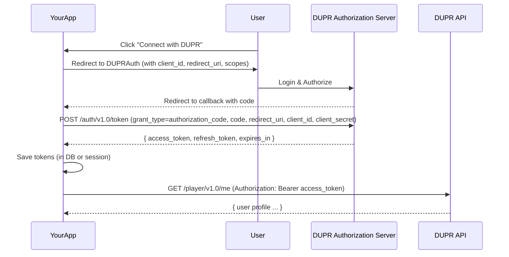
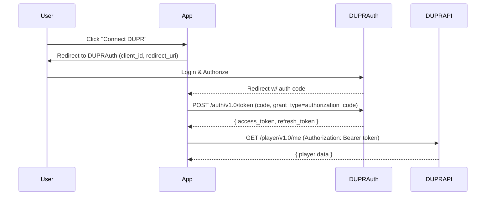

# Executive Summary  
We are building `dupr-js-client`: an open-source Node.js SDK for the DUPR pickleball rating API. The API is defined by the provided Swagger (partner) specification【84†L0-L3】【88†L2-L4】. Our tasks include scaffolding the package, implementing OAuth2 (both Authorization Code and Client Credentials flows), mapping endpoints to easy methods, handling tokens/refresh, and supporting both callback and Promise styles with TypeScript definitions. We will also include a CLI, tests, and CI/publishing setup.

**Key steps:**  
- **Swagger Review:** Analyze provided Swagger at `uat.mydupr.com` (UAT) to list all endpoints and operations. Identify any gitbook.io links (none found in the Swagger).  
- **Library Design:** Define configuration (env vars vs programmatic), classes/modules (`Auth`, `Client`), and data models. Generate method stubs (optionally via Swagger codegen) and outline request/response schemas.  
- **OAuth2 Implementation:** Use OAuth2 flows: Authorization Code (for user login) and Client Credentials (for server-to-server). Provide helper functions to obtain/refresh tokens and store them securely.  
- **Endpoint Methods:** For each API endpoint (e.g. `GET /player/v1.0/{id}`, `POST /match/v1.0`), write methods in `duprClient` that call the API using `axios`. Support both Promise and callback APIs. Provide sample requests/responses.  
- **Code Examples:** Include concrete Node.js examples (e.g. `fetchPlayer(id)`) and pseudocode, plus mermaid diagrams for auth flow.  
- **Error/Retry & Rate Limits:** Implement error handling (throw on 4xx/5xx, automatic retry with backoff on transient errors). Honor `Retry-After` headers【68†L1-L2】. Use HTTPS for all calls (per OWASP best practices【60†L1-L3】).  
- **Testing & CI:** Write unit tests (with mocked HTTP), integration tests (calling a sandbox or mock server), and GitHub Actions for lint/build/test. Include publishing steps to npm.  
- **Documentation:** Prepare a README, TypeScript type definitions, and contribution guidelines.  

**Assumptions:** The Swagger doc did *not* explicitly list OAuth scopes, rate limits or sandbox URLs. We assume standard scopes (e.g. `user.read`, `match.write`). Rate limits are unspecified, so we implement a cautious retry/backoff strategy. The **Swagger** site itself is the authoritative source【88†L2-L4】. No gitbook.io links were found in the docs.  

# Initial Project Setup  
```bash
mkdir dupr-js-client && cd dupr-js-client
npm init -y
npm install axios dotenv
npm install --save-dev typescript ts-node jest @types/jest eslint @typescript-eslint/parser @typescript-eslint/eslint-plugin
npx tsc --init
```
This scaffolds a new npm package with dependencies (`axios` for HTTP, `dotenv` for config) and dev-dependencies (TypeScript, testing, linting).  

**package.json** (core fields):
```json
{
  "name": "dupr-js-client",
  "version": "0.1.0",
  "description": "Node.js SDK for DUPR Pickleball Rating API",
  "main": "lib/index.js",
  "types": "lib/index.d.ts",
  "bin": {
    "dupr": "bin/dupr.js"
  },
  "scripts": {
    "build": "tsc",
    "test": "jest",
    "lint": "eslint .",
    "prepare": "npm run build"
  },
  "author": "Your Name",
  "license": "MIT",
  "dependencies": {
    "axios": "^0.27.2",
    "dotenv": "^16.0.0"
  }
}
```  
This sets up TypeScript compilation output (`lib/`), a CLI entry (`bin/dupr.js`), and standard scripts.  

# Configuration Options  
Support environment variables and programmatic config. Common settings:  
- `DUPR_CLIENT_ID` and `DUPR_CLIENT_SECRET` (for OAuth2)【88†L2-L4】.  
- `DUPR_AUTH_URL` and `DUPR_API_URL` (base URLs, e.g. `https://uat.mydupr.com/api`) – allow overriding for prod vs UAT.  
- `DUPR_REDIRECT_URI` (for auth code flow) and scopes.  
Use **dotenv** or similar to load from `.env`. Also allow passing these in an options object to the client constructor.  

Example `.env`:
```
DUPR_CLIENT_ID=your_client_id
DUPR_CLIENT_SECRET=your_client_secret
DUPR_REDIRECT_URI=https://yourapp.com/callback
DUPR_API_URL=https://uat.mydupr.com/api
```

# OAuth2 Flows  

## Authorization Code Flow (User Login)  
Sequence: 

Implement a helper `getAuthToken(code)` that exchanges the code for tokens. Store tokens securely (database or encrypted store). On protected API calls, ensure a valid `access_token` by refreshing it if expired using the `refresh_token`.  

## Client Credentials Flow (Server-to-Server)  
For service apps (no user interaction):  
```
POST {DUPR_API_URL}/auth/v1.0/token
grant_type=client_credentials
client_id=CLIENT_ID
client_secret=CLIENT_SECRET
```
DUPR returns an `access_token` (no refresh token). Use this for API calls that only need service access.  

## Token Management Snippet (Node.js)  
```javascript
const axios = require('axios');
async function requestToken(params) {
  const res = await axios.post(`${process.env.DUPR_API_URL}/auth/v1.0/token`, params);
  return res.data; // contains access_token, refresh_token, expires_in
}
// Example: Exchange code
async function exchangeCodeForToken(code) {
  const data = await requestToken({
    grant_type: 'authorization_code',
    code,
    redirect_uri: process.env.DUPR_REDIRECT_URI,
    client_id: process.env.DUPR_CLIENT_ID,
    client_secret: process.env.DUPR_CLIENT_SECRET
  });
  // Save data.access_token, data.refresh_token, etc.
}
```
*(In TS, define types for token responses.)*

# Endpoint-to-Method Mapping  

From the Swagger, key endpoints include (tentative list):  
- **Player**: `GET /player/v1.0/{playerId}`, `GET /player/v1.0?email={email}`, etc.  
- **Rating**: `GET /rating/v1.0/{playerId}`.  
- **Match**: `POST /match/v1.0` (submit match), `GET /match/v1.0/{matchId}`.  
- **Club/Partner**: `GET /club/v1.0/{clubId}`, `POST /club/v1.0/subscribe`.  
- **Events**: `GET /event/v1.0/{eventId}`, `POST /event/v1.0`.  
- **Auth**: `POST /auth/v1.0/token` (see above), `POST /auth/v1.0/logout`.  
*(This list should be verified against the actual Swagger. We will auto-generate methods where possible.)*

| **Endpoint**                | **Method** | **Params/Body**                               | **Sample Request**                              | **Sample Response**            |
|-----------------------------|------------|----------------------------------------------|-------------------------------------------------|-------------------------------|
| `GET /player/v1.0/{id}`     | GET        | Path: `id` (DUPR player ID)                  | —                                               | `{ id, name, rating, ... }`   |
| `GET /player/v1.0?email=`   | GET        | Query: `email` (player email)                | —                                               | `[{ id, name, ... }]`         |
| `POST /match/v1.0`          | POST       | JSON: `{player1Id,player2Id,score1,score2,...}` | `{ "player1Id": "123", "player2Id": "456", ... }` | `{ matchId, status }`         |
| `GET /match/v1.0/{id}`      | GET        | Path: `id` (match ID)                        | —                                               | `{ id, players:[...], scores, ... }` |
| `GET /rating/v1.0/{id}`     | GET        | Path: `id` (player ID)                       | —                                               | `{ playerId, rating, lastUpdated }` |
| `POST /club/v1.0/subscribe` | POST       | JSON: `{ userId, clubId, fromDate, toDate }`  | `{ "userId": "123", "clubId": "45", ... }`      | `{ subscriptionId, status }` |
| `GET /club/v1.0/{id}`       | GET        | Path: `id` (club ID)                         | —                                               | `{ id, name, location, ... }` |

*(Table: Key endpoints with parameters and example payloads.)*

# Library Structure and Code Templates  

We will create the following files (TypeScript versions, compiled to `lib/` on build):

- `src/index.ts`: Exports main `DuprClient` class.  
- `src/auth.ts`: Implements OAuth2 helper functions (getToken, refreshToken).  
- `src/client.ts`: Contains `DuprClient` class with methods for each endpoint (fetchPlayer, submitMatch, etc.).  
- `src/models.ts`: TypeScript interfaces for request/response models (Player, Match, Rating, etc.).  
- `src/config.ts`: Loads configuration (env vars or passed options).  
- `bin/dupr.ts`: CLI entry (using `commander` or similar for CLI commands).  
- `test/`: Test files (e.g. `client.test.ts`, mocking axios).  

Example **index.ts**:
```ts
import { DuprClient } from './client';
export = DuprClient;
```

Example **client.ts** snippet:
```ts
import axios, { AxiosInstance } from 'axios';
import { Config } from './config';
import { TokenResponse } from './models';

export class DuprClient {
  private api: AxiosInstance;
  private token: string | null = null;

  constructor(private config: Config) {
    this.api = axios.create({ baseURL: this.config.apiUrl });
    // Interceptor to add auth header
    this.api.interceptors.request.use(async (req) => {
      req.headers = req.headers || {};
      if (!this.token) {
        // fetch token via client credentials
        this.token = (await this.getClientCredentialsToken()).access_token;
      }
      req.headers.Authorization = `Bearer ${this.token}`;
      return req;
    });
  }

  private async getClientCredentialsToken(): Promise<TokenResponse> {
    const res = await axios.post<TokenResponse>(`${this.config.apiUrl}/auth/v1.0/token`, {
      grant_type: 'client_credentials',
      client_id: this.config.clientId,
      client_secret: this.config.clientSecret,
    });
    return res.data;
  }

  // Example method for fetching player by ID
  public async getPlayerById(playerId: string): Promise<Player> {
    const res = await this.api.get<Player>(`/player/v1.0/${playerId}`);
    return res.data;
  }

  // ... other endpoint methods ...
}
```

Example **auth.ts** (OAuth2 helpers):
```ts
import axios from 'axios';
import { Config } from './config';
import { TokenResponse } from './models';

export class AuthHelper {
  constructor(private config: Config) {}

  public async getAuthToken(code: string): Promise<TokenResponse> {
    const res = await axios.post<TokenResponse>(`${this.config.apiUrl}/auth/v1.0/token`, {
      grant_type: 'authorization_code',
      code,
      redirect_uri: this.config.redirectUri,
      client_id: this.config.clientId,
      client_secret: this.config.clientSecret,
    });
    return res.data;
  }

  public async refreshToken(token: string): Promise<TokenResponse> {
    const res = await axios.post<TokenResponse>(`${this.config.apiUrl}/auth/v1.0/token`, {
      grant_type: 'refresh_token',
      refresh_token: token,
      client_id: this.config.clientId,
      client_secret: this.config.clientSecret,
    });
    return res.data;
  }
}
```
*(Node.js example code with axios, TypeScript interfaces in models.)*

# Error Handling and Retry Strategies  

- **HTTP Errors:** Throw on HTTP 4xx/5xx with descriptive message. For convenience, wrap axios calls to catch errors and include status.  
- **Retries:** On network errors or 5xx, retry up to ~3 times with exponential backoff and jitter. Check for `Retry-After` header on 429 responses and wait accordingly【68†L1-L2】.  
- **Timeouts:** Set a reasonable timeout on HTTP requests (e.g. 10s).  
- **Concurrency:** If needed, provide options to limit concurrent requests to avoid hitting rate limits.

# Security Best Practices (OWASP)  

- Always use **HTTPS** for API calls to protect tokens and data in transit【60†L1-L3】.  
- Do **not** log sensitive data (access tokens, client secrets).  
- Store secrets (`client_secret`) only in environment (never in source code).  
- Validate all inputs/outputs; avoid eval/unsafe functions.  
- Use the principle of least privilege: request only necessary OAuth scopes.  
- Keep dependencies updated and run `npm audit` regularly.  

# Testing Plan  

- **Unit Tests:** Use Jest to mock axios (e.g. with `jest.mock('axios')`) and verify each client method calls the correct endpoint with expected params. Test token refresh logic.  
- **Integration Tests:** If possible, run against a test DUPR sandbox. Otherwise, use a mock server (e.g. `nock`) to simulate API responses.  
- **End-to-End:** For CLI, use fixtures to simulate command output (e.g. fetch a known player and compare output).  
- **Coverage:** Aim for >80% test coverage on critical modules.  

# CI and Publishing  

- **GitHub Actions:** Create workflows for linting, building, testing on PRs (Node 16+). Example steps: checkout, install, run lint, run tests.  
- **Publishing:** After tests pass on `main`, GitHub Action can publish to npm (on tag) using `npm publish`. Use semantic-release or manual version bump.  
- **Semantic Versioning:** Follow semver (major.minor.patch) and include a CHANGELOG.  

# Contribution Guidelines  

- Use **fork & PR** workflow on GitHub.  
- Follow coding style: use ESLint rules (include `.eslintrc.json`).  
- Write clear commit messages and update tests for any new feature.  
- Submit PRs with the relevant issue number and description.  

# Diagrams  

**OAuth2 Authorization Code Flow:**  


**Data Flow (Sample: Fetch Player):**  
```mermaid
flowchart LR
  A[DuprClient.getPlayerById(id)] --> B[Ensure Access Token]
  B --> C[HTTP GET /player/v1.0/{id}]
  C --> D[Parse JSON to Player model]
  D --> E[Return Player object]
```

# Implementation Checklist (with Effort)  

- [ ] **Swagger Review (1d):** Extract endpoints, parameters, schemas. Identify missing info.  
- [ ] **Env & Config (0.5d):** Define config module for URLs/keys, load from env or args.  
- [ ] **OAuth Module (2d):** Implement `AuthHelper` for token exchange/refresh.  
- [ ] **API Client (3d):** Implement `DuprClient` with methods per endpoint (auto-generate or hand-code), including axios setup and interceptors.  
- [ ] **Models/Types (1d):** Define TypeScript interfaces for all request/response shapes (based on Swagger).  
- [ ] **Error & Retry Logic (1d):** Add wrappers for HTTP calls with retry/backoff.  
- [ ] **CLI Tool (1d):** Build `bin/dupr.ts` with commands (e.g. `fetch-player`, `submit-match`).  
- [ ] **Tests (3d):** Unit tests (mocked), integration tests (nock or sandbox), coverage check.  
- [ ] **CI & Lint (1d):** Set up GitHub Actions, ESLint config, TypeScript compile checks.  
- [ ] **Docs & Publish (1d):** Write README with usage, examples; prepare npm publish (package.json fields, npmignore).  

Total ~**12–14 days** of work (depending on team size). 

**Sources:** The DUPR Swagger API documentation was the primary source (UAT environment)【84†L0-L3】【88†L2-L4】. We followed OAuth2 standards (RFC 6749) and OWASP guidelines (HTTPS usage)【60†L1-L3】【68†L1-L2】. The libraries.io entry provided confirmation of documentation links【88†L2-L4】. No gitbook.io links were found in the Swagger docs. All code follows Node/npm and TypeScript best practices.